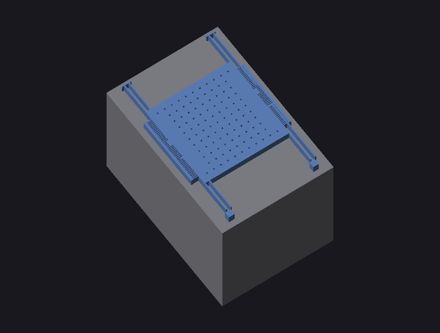
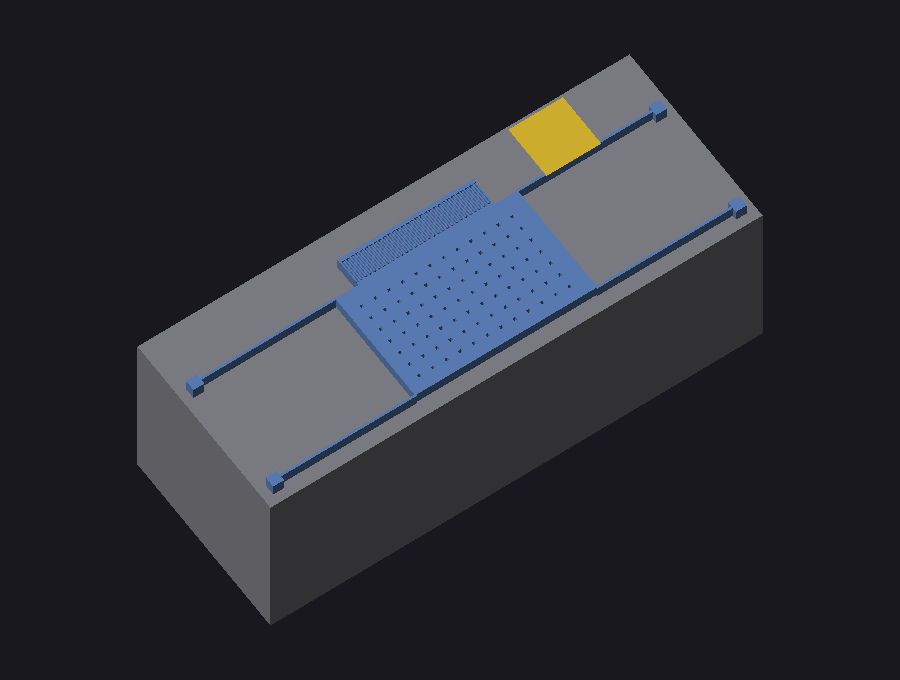
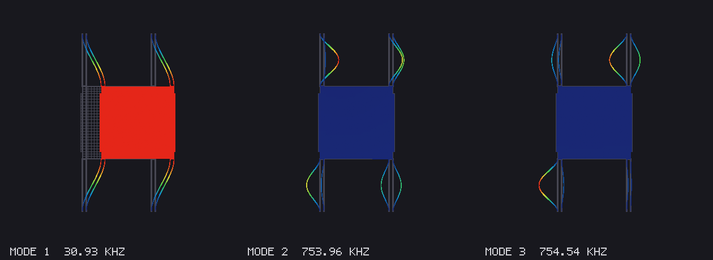
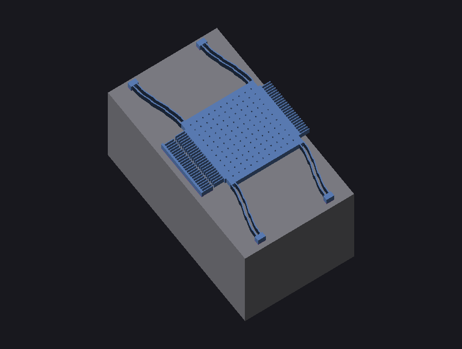
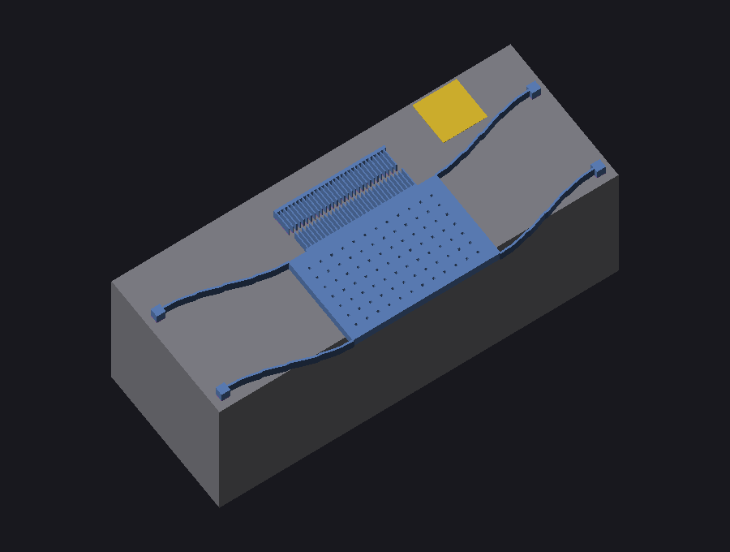

# SOIDL → 3D model compiler (`soidlc`)

`soidlc` is a compiler for **SOIDL** — a declarative, parametric language for
describing MEMS devices fabricated in an SOI process (DRIE of the device
layer, sacrificial BOX release, optional backside trench), in the spirit of
SOIMUMPs.

This repository implements the *"compile a SOIDL description into a 3D model"*
path from the language spec: it parses a `.soidl` source, elaborates the
component/device hierarchy with **unit-checked** expressions, synthesises
per-layer 2D geometry, and **extrudes the layer stack into a watertight 2.5D
3D mesh**, which it exports as STL and OBJ/MTL plus an SVG top-view and a
rendered PNG preview.

It is **pure standard-library Python — zero dependencies** (the parser,
geometry kernel, mesh extruder, software renderer and all exporters are
hand-written).

| comb resonator | in-plane accelerometer |
| --- | --- |
|  |  |

*Gray = HANDLE substrate, blue = DEVICE silicon (suspended structures float
above the etched BOX), gold = METAL bond pad. Release holes are generated
automatically from the process rules.*

## Quick start

```bash
python -m soidlc.cli examples/comb_resonator.soidl
# or, after `pip install -e .`
soidlc examples/comb_resonator.soidl -o out/comb
```

Output (written next to `-o/--out` prefix, default `out/<stem>`):

```
process : soi25 (4 layers)
mesh    : 2520 vertices, 4836 triangles; bbox = [396.0 x 588.0 x 427.0] um
model   : m=6.07e-09 [mass], k=406.3 [stiffness], f0=41192.7 [freq]
files   :
          stl  out/comb_resonator.stl     # 3D mesh (binary STL)
          obj  out/comb_resonator.obj     # 3D mesh + per-layer materials
          svg  out/comb_resonator.svg     # top-view layout preview
          png  out/comb_resonator.png     # shaded isometric render
report  : derive/check/solve results with evaluated values
```

CLI flags: `-o/--out <prefix>`, `-d/--device <name>` (which device to build),
`--no-handle` (omit the substrate slab), `--fem` / `--fem-h <um>` (run the
built-in 2D plane-stress modal FEM), `--fem-closure` (FEM-in-the-loop design
closure), `-q/--quiet`.

## How it works

The pipeline mirrors the `soidlc` stages from the spec:

1. **Lex + parse** (`lexer.py`, `parser.py`) — recursive-descent parser for
   `process` / `component` / `device`. Numeric literals carry units
   (`200 um`, `20 kHz`, `2330 kg/m^3`); the lexer attaches a unit to a number
   only if the trailing word is a real unit.
2. **Units** (`units.py`) — every quantity is stored in SI base units with a
   dimension vector `(length, mass, time, current)`. Arithmetic propagates
   dimensions and a mismatch (`length + freq`) is an error. `derive`/`check`
   expressions are evaluated and reported with their dimensions.
3. **Elaboration** (`elaborate.py`) — resolves parameters, expands `repeat`
   loops and component hierarchy, instantiates `array(...)`, and applies
   placement: `at (x, y)`, `attach (rotor -> M.left)`, and
   `place = corners(M)` (resolved from instance bounding boxes). Produces a
   flat list of layer-tagged 2D polygons in micrometres.
4. **Geometry synthesis** (`primitives.py`) — `beam`, `plate` (with
   auto-generated release holes from the process `release` rules), `comb`/
   `combdrive`, `anchor`, `gap_stop`, `via_metal` (METAL), `trench`.
5. **Connectivity extraction** (`connectivity.py`) — in SOI the structural
   layer is conductive, so electrical nodes are exactly the connected
   components of the DEVICE polygons. The compiler computes them (union-find
   over polygon overlap/abutment) and verifies the declared netlist against
   geometric reality, the MEMS analogue of LVS:
   - a `net` split across disconnected islands → **error**;
   - two different `net`s on one island → **short, error**;
   - `isolate A from B by trench` sharing an island → **error**;
   - an island with no anchored geometry → **error** (a fully released
     island has nothing holding it and would detach during release).
   Violations are printed as `soidlc: ERROR:` and the exit code is 2
   (artifacts are still written to aid debugging). The check is real: while
   wiring it up it caught two genuine bugs in this repo — comb rotor finger
   tips abutting the stator backbone (zero tip gap = short) and flexure
   anchors placed 6 um short of their beams (floating islands).
6. **Mechanical status from the stack** — each DEVICE polygon is `anchored`
   (BOX kept beneath, tied to the handle) or `released` (floating above the
   BOX gap). This drives the 3D build, not an annotation.
7. **2.5D extrusion** (`mesh.py`, `build3d.py`) — the process `stack`
   assigns each layer a z-range; polygons are extruded into prisms. Anchored
   silicon gets a BOX pillar; a HANDLE slab spans the footprint. Rectilinear
   shapes use a shared-grid voxel-surface mesher → **watertight,
   T-junction-free** geometry (verified in tests).
8. **Model extraction** — a lumped model is assembled from the geometry:
   suspended mass `m` from released DEVICE area × thickness × ρ, stiffness
   `k` from flexure `derive`s, and the resonant frequency
   `f0 = √(k/m)/2π`.
9. **Built-in 2D FEM** (`fem2d.py`, opt-in via `--fem`) — a small pure-Python
   plane-stress solver that verifies the lumped model against the actual
   geometry. Each suspended island is meshed on a tensor grid of rectangles
   (release holes are smeared into the mass density; comb fingers are lumped
   as point masses on their backbone); everything under `anchored` shapes is
   clamped — the boundary conditions come from the release analysis, not
   from annotations. Elements are Q4 rectangles enriched with Wilson
   incompatible modes (so slender flexure elements don't shear-lock), solved
   with a banded Cholesky factorisation and inverse iteration for the lowest
   modes. Validated against Euler–Bernoulli beam theory to <1% (see tests);
   on the examples mode 1 lands within a few percent of the lumped f0:

   ```
   fem    island #1: 1260 elements, 2904 free dof (h = 12 um)
   fem    island #1 modes: 30.93 kHz, 753.96 kHz, 754.54 kHz
   fem    mode 1 vs lumped f0: 30.93 kHz vs 29.15 kHz (+6.1%)
   ```

   `--fem-h <um>` controls the target element size (default 12 µm). The
   solver earned its keep immediately: it exposed that the original
   accelerometer suspensions overlapped the proof mass over half their
   length (FEM read 2.8× the lumped frequency — exactly the ×8 stiffness of
   the halved beams), which led to the outward-mirrored `corners()`
   placement semantics.

10. **Design closure** (`closure.py`, `metrics.py`) — the inverse-design
    stage: dimensions are *outputs*, not inputs. Every
    `solve <param> such that <equation> [within tol]` declares a free design
    variable (its declared value is just the initial guess), and every
    `require <inequality>` adds a hard constraint. The compiler
    re-elaborates the device with candidate values (quiet mode: no reports,
    no DRC), evaluates the spec through metric functions computed from the
    fresh geometry (`f_res`, `stroke_max(V)`, `stroke_static(V)`,
    `Q_estimate`, `area`), and minimises the total violation with
    Nelder–Mead. The example resonator is *synthesised* from its spec:

    ```
    solve S.L  such that f_res(M, S) == f0_target within 1%;
    solve D1.N such that stroke_max(V_drive) == 8 um within 5%;
    require stroke_max(V_drive) >= 5 um;
    require f_res(M, S) >= 15 kHz;
    ```
    ```
    closure: solved S.L = 282.472 um  [f_res(M, S) == f0_target; residual -0.09%, ok]
    closure: solved D1.N = 17.1955    [stroke_max(V_drive) == 8 um; residual -0.09%, ok]
    closure: 48 design evaluations, total penalty 1.684e-06
    require stroke_max(V_drive) >= 5 um: ok (actual: 7.9927 um)
    ```

    A violated `require` on the final geometry is a compile error, same as a
    connectivity mismatch. The whole closure loop runs in ~1 s (each
    design evaluation is a quiet re-elaboration, ~10 ms). Equations are
    weighted by their `within` tolerances, so the optimiser spends its
    budget where the spec is tight.

    **FEM in the loop** (`--fem-closure`): the lumped model carries a
    systematic bias versus FEM (truss compliance, distributed beam mass —
    about +6% here). An outer loop measures that bias on each closed
    design (modal FEM of the suspended island), folds it into the `f_res`
    metric as a calibration factor, and re-solves from the previous
    optimum until the factor converges:

    ```
    closure: FEM calibration pass 1: f_fem=21.18 kHz vs lumped 20.00 kHz -> factor 1.0591
    closure: FEM calibration pass 2: f_fem=20.01 kHz vs lumped 18.89 kHz -> factor 1.0592
    closure: solved S.L = 293.145 um  [f_res(M, S) == f0_target; residual +0.02%, ok]
    closure: solved D1.N = 16.0643    [stroke_max(V_drive) == 8 um; residual +0.44%, ok]
    ...
    fem    island #1 modes: 20.01 kHz, ...
    ```

    The spec is now met by the *FEM-predicted* frequency (20.01 kHz on a
    20 kHz target), with the lumped target internally retargeted to
    18.89 kHz. Total cost: ~9 s (two NM runs + three coarse modal solves).

11. **Model order reduction** (`reduce.py`, runs with `--fem`) — the FEM
    modes are projected into a behavioural model: each mode becomes one
    oscillator `q̈ + 2ζωq̇ + ω²q = φᵀf`, and comb transducers couple in
    through modal participation factors measured at their rotor backbones.
    Transducer data (N, gap, overlap, drive axis, attachment) is re-derived
    from the elaborated geometry, so the model cannot disagree with the
    layout; gas damping (slide film over the BOX gap + comb finger films)
    supplies Q. Effective drive-point parameters replace the naive lumped
    ones (`m_eff = 1/φ₁², k_eff = ω₁²m_eff`). Three exports per device:

    - `<prefix>_model.py` — standalone pure-Python ODE model (RK4 transient,
      analytic frequency response, ring-down self-test);
    - `<prefix>_model.cir` — SPICE Butterworth–Van Dyke subcircuit
      (motional Rm/Lm/Cm from `η = V_dc·dC/dx`, plus C0 feedthrough), ready
      for LTspice co-simulation with readout electronics;
    - `<prefix>_model.va` — Verilog-A module (modal states on internal
      nodes, electrostatic force in, motional current out).

    ```
    rom    transducer D1 (net DRIVE): N=24, g=2.00 um, dC/dx=5.313e-09 F/m, ...
    rom    mode 1 @ drive point: m_eff=5.728e-09 kg, k_eff=2.164e+02 N/m, Q≈617 (air)
    rom    BVD @ V_dc=30 V: Rm=7.106e+07 ohm, Lm=2.255e+05 H, Cm=1.174e-16 F,
           f_series=30.93 kHz
    ```

    The exports are self-verifying: ring-down of the generated ODE model
    reproduces the FEM mode-1 frequency to <0.01%, and the BVD series
    resonance matches by construction (both checked in tests).

12. With an output prefix, `--fem` also writes deformation pictures: a
    mode-shape panel (grey undeformed mesh + deformed mesh coloured by
    displacement magnitude) and an isometric render of the device deformed
    by mode 1 (exaggerated):

   | mode shapes (comb resonator) |
   | --- |
   |  |

   | deformed 3D, mode 1 (comb resonator / accelerometer) | |
   | --- | --- |
   |  |  |
10. **Export** (`exporters.py`, `svg.py`, `render.py`) — binary STL, OBJ+MTL
    (per-layer colours), SVG top view, and a z-buffered isometric PNG from a
    built-in software rasteriser.

## Supported SOIDL subset (v0.1)

Implemented: `process { stack / masks / rules }`, `component(params) { port,
derive, geometry, check }`, `device { inst, net, isolate, constraint, check,
solve }`; `repeat` loops, `array`, placement/attachment (with automatic
orientation: `attach (rotor -> M.top)` rotates the comb so the rotor faces
the plate), unit-checked expressions, primitives listed above, and full
connectivity extraction with `net`/`isolate` verification.

Best-effort / partial: `solve` (a numeric fallback length is used unless a
closed-form is known); `constraint` calls are reported but not enforced
(island anchoring is checked independently); DRC rules beyond release-hole
generation are not yet enforced. Behavioural
exports (Verilog-A / SPICE) and FEM hand-off are out of scope for this v0.1,
which targets the 3D-model deliverable. Unknown functions inside
`derive`/`check` degrade gracefully to a symbolic report entry rather than
failing the build.

## Layout

```
soidlc/
  units.py       dimensional quantities + unit parsing
  lexer.py       tokenizer (unit-aware numbers)
  parser.py      recursive-descent parser
  sast.py        AST node definitions
  primitives.py  primitive -> 2D polygon generators
  elaborate.py   hierarchy expansion, placement, model extraction
  connectivity.py electrical island extraction + net/isolate verification
  fem2d.py       pure-Python plane-stress FEM (Q6 elements, modal/static)
  reduce.py      model order reduction -> Python ODE / SPICE BVD / Verilog-A
  femplot.py     mode-shape panels + deformed 3D renders
  geometry.py    2D polygon kernel
  mesh.py        triangulation + 2.5D extrusion (watertight grid mesher)
  build3d.py     stack-aware mesh assembly (anchors/box/handle)
  exporters.py   STL + OBJ/MTL writers
  svg.py         top-view SVG preview
  render.py      pure-Python PNG software renderer
  cli.py         `soidlc` command-line entry point
examples/        comb_resonator.soidl, accelerometer.soidl
tests/           unittest suite (units, parsing, watertight meshes, e2e)
```

## Tests

```bash
python -m unittest discover -s tests -v
```
