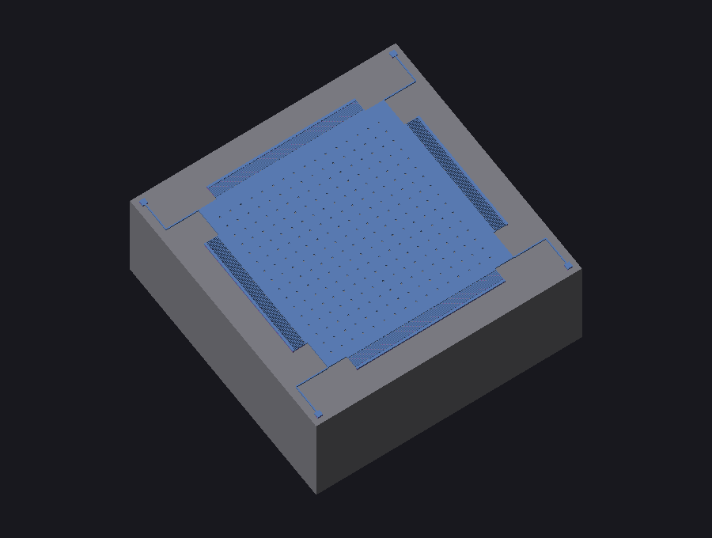
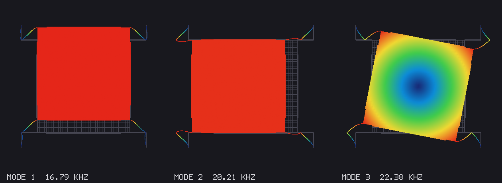

# Reproducing & comparing against a published gyroscope

**Reference:** A. Sharaf, S. Sedky, M. Serry, A. Elshurafa, M. Ashour,
S. E.-D. Habib, *"A Fully Symmetric and Completely Decoupled MEMS-SOI
Gyroscope"*, NSTI-Nanotech 2010, Vol. 2, pp. 386–389
(ISBN 978-1-4398-3402-2).

We re-built this gyroscope from its published process and targets in SOIDL
(`examples/gyroscope.soidl`) and compared what `soidlc` predicts against the
paper. The brief publishes the **process** (5 µm SOI, 2 µm features, comb
`l0 = 20 µm` / `g0 = 2 µm`), the **simulated mode frequencies** (~16.8 kHz,
matched), the **comb capacitances** and the **die area** — but *not* the
spring lengths. So, exactly as the authors did, we let design-closure solve
the suspension length to the 16.8 kHz target, and inferred the comb finger
counts from the published capacitance (`C0 = N·2ε0·t·l0/g0`). Everything
else is an **emergent prediction** we did not fit.




*Modes 1 and 2 are the two rigid-plate translations — the drive (y) and
sense (x) modes; mode 3 is the in-plane rotational mode.*

## Side-by-side

| Quantity | Paper (sim / meas) | soidlc | Comment |
|---|---|---|---|
| Device-layer thickness | 5 µm | 5 µm | input (process) |
| Comb overlap / gap | 20 µm / 2 µm | 20 µm / 2 µm | input |
| **Drive mode frequency** | 16,786 / 16,769 Hz (ANSYS/COMSOL) | **16,790 Hz** (our FEM) | **<0.2 %** — closure + FEM-in-the-loop |
| Sense mode frequency | 16,800 / 16,797 Hz | 20,210 Hz | see *mode split* below |
| **Mode split (sense−drive)** | **0.08 %** | **20.4 %** | our raw structure is *not* mode-matched |
| Drive comb capacitance | 239 fF | 202 fF (2 × 100.9) | −15 %, finger count inferred |
| Sense comb capacitance | 274.5 fF | 236 fF (2 × 117.8) | −14 % |
| Quality factor (air) | ~10 (measured) | ~112 (gas model) | both low/air-dominated; we are ~10× optimistic |
| Quality factor (vacuum) | 900 / 550 | — | anchor/thermo-elastic loss not modelled |
| Die area | 1.6 × 1.6 mm | 0.96 × 0.96 mm | ours more compact (smaller proof mass) |
| Suspension length | not published | 121 µm (solved) | the free variable |

## What matches, and what the gaps tell us

**Frequency — excellent (<0.2 %).** The headline number is reproduced almost
exactly. Note the path: the lumped single-beam stiffness formula
`k = E·t·w³/L³` *overestimates* a crab-leg (two beams in series ≈ 2× softer),
so plain closure landed 25 % low. FEM-in-the-loop measured that systematic
bias (factor 0.748), retargeted the lumped model, and re-solved — driving the
*FEM-predicted* frequency onto 16.8 kHz. This is exactly the lumped→FEM
calibration loop doing its job on a real device.

**Mode split — the interesting discrepancy.** Our two translation modes come
out 20 % apart; the paper's are matched to 0.08 %. That is *not* a bug — it is
the paper's whole contribution. A plain proof-mass-on-four-crab-legs cannot
hold its x and y modes degenerate once the drive and sense combs (different
finger counts → different added mass on the x vs y backbones, faithful to the
paper's unequal 239/274 fF caps) break the symmetry. The authors solve this
with an **intermediate decoupling mass** and **electrostatic tuning combs**
("four sets of control combs … to tune the resonance frequency externally via
electric voltage") — neither of which we model. So the comparison cleanly
isolates *why* the decoupled architecture is needed.

**Capacitance — within ~15 %.** Inferring N from the published caps and
re-deriving C from our geometry closes to 15 %; the residual is comb pitch
(the real device packs fingers denser than our 8 µm single-row pitch allows).

**Q in air — right regime, ~10× optimistic.** Our first-principles gas model
(slide film under the plate + comb films) predicts Q ≈ 112, correctly in the
*tens*, consistent with the paper's measured air Q of ~10 and far below its
vacuum Q of 550–900. The order-of-magnitude offset is the known weakness:
squeeze-film between hundreds of 2 µm-spaced fingers dominates the real device
and our film model under-counts it. Vacuum Q (anchor/TED-limited) we do not
model at all.

## Reproduce

```bash
python -m soidlc.cli examples/gyroscope.soidl -o out/gyroscope \
       --fem --fem-h 18 --fem-closure
python examples/compare_paper1342.py        # prints the table above
```
